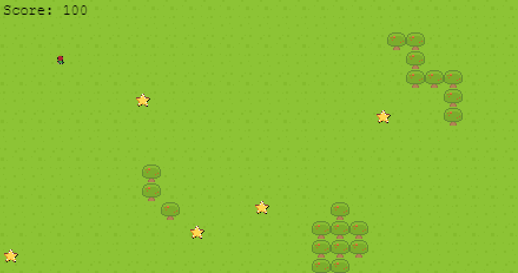

**🎮️ Name of the game: Hidden eliens
👥 Authors:**

## Elisha Kyakopo

  Linkedin: [Elisha Kyakopo](https://www.linkedin.com/in/elisha-kyakopo/)

  Github: [@elisha2kyakpo1](https://github.com/elisha2kyakpo1)

  Twitter: [@elisha1k](https://twitter.com/Elisha1k)

# Overview

##  Project scope

- **Time frame: Within 5 working days**

## 🗣️ About the game

_This is an RPG game, where a player goes by collecting fallen stars in a forest, aiming at collecting as many as he/she can can manage, but guess what! the forest has bad zones. A player has to be careful not to move carelessly. Does this game sound familiar_

## 💵 Monetization

_This was created for educational purposes only._

# Gameplay

You can play the game just by using keyboard arrow keys.

## Game project structure

- Details: Build platform game with Phaser3 Library
- How it works: Using Phaser3 JS library to create the canvas/webGl and different scenes.
- How it works: Collected assets from different resources and used Phaser3 to animate and edit different features like size, respawn, velocity, movement, color.
- Details: Add game objects
- How it works: Added glowing stars and hidden zones and modified score upon collecting stars and death scene upon entering danger zones.
- Details: Add a Learderboard
- How it works: Use API to store player name and score, Then get this data and sort the top highest 5 scores and display them.

# Game elements

# 👤 Characters / 📦️ Objects

- A person in the forest
- Stars
- Trees
- Grasses
